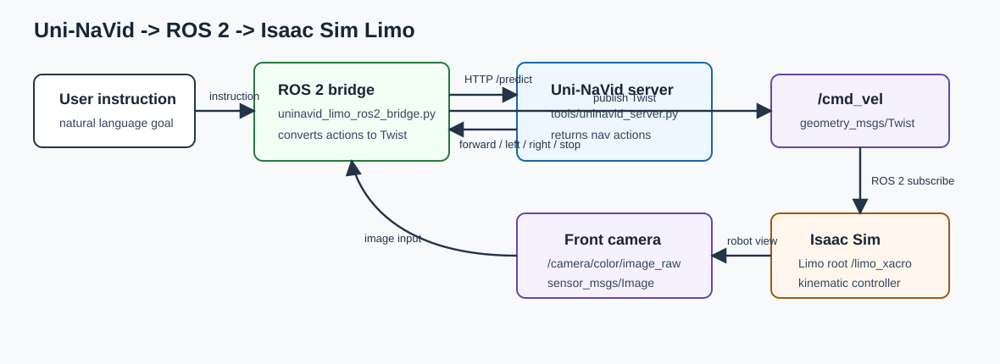
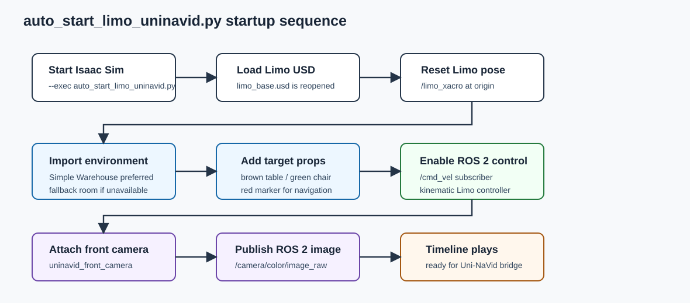
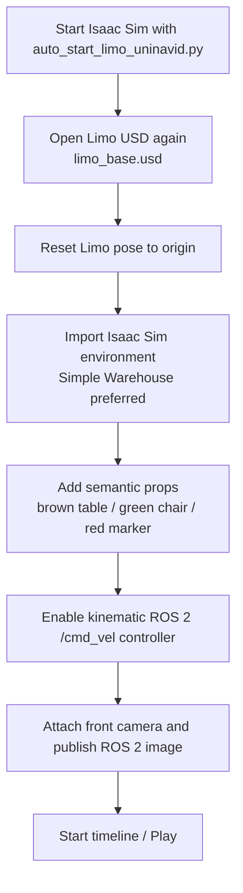

# Limo Isaac-SIM Simulation Operation Process

## Uni-NaVid + Isaac Sim + ROS 2 pipeline

This fork adds an automated Isaac Sim 5.1 setup for driving AgileX Limo from
Uni-NaVid visual-language navigation outputs.

<p align="center">
  
</p>

<p align="center">
  
</p>

```mermaid
flowchart LR
    A[User instruction] --> B[Uni-NaVid ROS 2 bridge]
    C[/camera/color/image_raw<br/>front Limo camera] --> B
    B -->|HTTP /predict| D[Uni-NaVid server<br/>tools/uninavid_server.py]
    D -->|actions: forward / left / right / stop| B
    B -->|geometry_msgs/Twist| E[/cmd_vel]
    E --> F[Isaac Sim ROS 2 node<br/>limo_goal_controller]
    F --> G[Limo USD root<br/>/limo_xacro]
    G --> C
```



### What runs where

| Component | File | Role |
| --- | --- | --- |
| Isaac Sim auto setup | `srcipts/auto_start_limo_uninavid.py` | Reopens the Limo USD, resets the robot, imports an Isaac environment, adds camera/ROS support, and starts the timeline. |
| Environment loader | `srcipts/add_uninavid_room_env.py` | Tries Isaac Sim built-in realistic warehouse assets first, then falls back to a generated room. |
| Limo ROS 2 controller | `srcipts/add_limo_goal_controller.py` | Subscribes `/cmd_vel` and moves the Limo root in Isaac Sim. This is kinematic for stability. |
| Camera publisher | `srcipts/add_limo_camera_ros2.py` and `srcipts/publish_active_viewport_camera_ros2.py` | Publishes the Limo front camera as `/camera/color/image_raw`. |
| Uni-NaVid bridge | `srcipts/uninavid_limo_ros2_bridge.py` | Sends camera images and text instruction to Uni-NaVid, then publishes `/cmd_vel`. |

### Quick start for this setup

Start Uni-NaVid server:

```bash
cd /home/novel/Uni-NaVid
.venv/bin/python tools/uninavid_server.py --host 127.0.0.1 --port 8088
```

Start Isaac Sim and rebuild the Limo scene:

```bash
/home/novel/apps/isaacsim/5.1.0/isaacsim/isaac-sim.sh \
  --exec /home/novel/Limo-Isaac-Sim/srcipts/auto_start_limo_uninavid.py
```

Drive Limo with Uni-NaVid:

```bash
cd /home/novel/Limo-Isaac-Sim
./srcipts/run_uninavid_limo_ros2.sh \
  "move forward to the brown table directly ahead, drive under it, and stop." \
  /camera/color/image_raw
```

Check ROS 2 topics and bridge output:

```bash
./srcipts/run_ros2_topic_list.sh
tail -f /tmp/uninavid_limo_bridge.log
```

Notes:

- The scene is rebuilt on every Isaac Sim launch, so a broken or manually edited Limo stage is not reused.
- The warehouse environment is loaded from Isaac Sim built-in assets when available. If those assets cannot be resolved, the script creates a lightweight fallback room.
- Limo motion is currently kinematic root motion driven by ROS 2 `/cmd_vel`. It is stable for Uni-NaVid testing, but it is not full tire-contact physics.


<p align="center">
  
</p>


## 1 Env 

**ubuntu20.04、Omniverse Launcher-1.9.8、Isaac-Sim-(2022.2.1 & 2023.1.1)**


## 2 Start [Omniverse](https://developer.nvidia.com/isaac-sim)

~~~python
./omniverse-launcher-linux.AppImage
~~~

Sign in omniverse account. please register, if you don't have an account.


## 2. Start Isaac-Sim

1. As shown in the following figure, click on the **LIBRARY Isaac-Sim LAUNCH** one by one. Download Isaac-Sim if without Isaac-Sim.

<p align="center">
  
</p>


2. Then, click on **START**.

<p align="center">
  
</p>


## 3 Import Limo-URDF Model

~~~python
# 1. git clone project
git clone https://github.com/agilexrobotics/Limo-Isaac-Sim.git

# 2. unzip meshes.zip and urdf.zip
cd Limo-Isaac-Sim/limo_description
unzip meshes.zip && unzip urdf.zip
~~~

2. As shown in the following figure, click on the **Isaac-Utils Workflows URDF-Importer** one by one.

<p align="center">
  
</p>

3. Select **correct path** of limo urdf and import it.

+ Correct Path

~~~python
./Limo-Isaac-Sim/urdf/limo_base.urdf
~~~

<p align="center">
  
</p>


If you are importing a mobile robot, you may need to change the following settings

+ Uncheck **Fix Base Link**

+ Set the **joint drive type** to Velocity drive

+ Set the Joint Drive Strength to the desired level. Note that this will be imported as the joint’s **damping parameter**. Joint stiffness are always set to 0 in velocity drive mode.


4. Successfully imported limo urdf as follows.


<p align="center">
  
</p>


## 4 Save Limo Asset

Save as Limo asset for easy import.

<p align="center">
  
</p>


## 5 Limo Simulated Motion

+ Detailed configuration reference[video](./docs/limo_motion.mp4)

<p align="center">
  
</p>


## 6 Driving Limo via ROS messages

[Detailed configuration reference](https://docs.omniverse.nvidia.com/isaacsim/latest/ros_tutorials/tutorial_ros_drive_turtlebot.html)

### 6.1 Building the Graph

<p align="center">
  
</p>


+ Note:
1. **ROS1_Subscribe_Twist** setup TopicName: **`/cmd_vel`** 
2. **Differential Controller** setup
    + `Max Linear Speed: 0.22`
    + `Wheel Distance: 0.16`
    + `Wheel Radius: 0.025`
3. **Articulation Controller** 
To assign the Articulation Controller node’s target to be the Turtlebot. In the property tab, unselect Use Path, and click on Target for the Prim, and find Turtlebot prim in the popup box. Make sure the robot prim you select is also where the Articulation Root API is applied. For some robots, the Articulation Root API is applied to a specific link of the robot and not the parent robot prim(**`/World/limo/limo_xacro`**).


4. **Constant Token & Make Array**
To put the names of the wheel joints in an array format, type in the names of the wheel joints inside each of the Constant Token nodes, and feed the array of the names into the Make Array Node. The names of the joints for the Turtlebot are **`front/rear_right_wheel`** and **`front/rear_left_wheel`**.


### 6.2 Verifying ROS connections

1. Press **`Play`** to start ticking the graph and the physics simulation.
2. Published to /cmd_vel topic to control the robot.

~~~python
rostopic pub /cmd_vel geometry_msgs/Twist '{linear:  {x: 0.2, y: 0.0, z: 0.0}, angular: {x: 0.0,y: 0.0,z: 0.0}}'
~~~

~~~python
rosrun limo_Isaac_sim limo_bringup.py
~~~

## 7 camera & Lidar

+ [Detailed camera configuration reference](https://docs.omniverse.nvidia.com/isaacsim/latest/ros_tutorials/tutorial_ros_camera.html#isaac-sim-app-tutorial-ros-camera)  or  [video](./docs/camare2ros.mp4)

+ [Detailed lidar configuration reference](https://docs.omniverse.nvidia.com/isaacsim/latest/ros_tutorials/tutorial_ros_sensors.html)


+ rviz show lidar data

<p align="center">
  
</p>


---

## References

[isaacsim](https://docs.omniverse.nvidia.com/isaacsim/latest/index.html)

[tutorial_advanced_import_urdf](https://docs.omniverse.nvidia.com/isaacsim/latest/advanced_tutorials/tutorial_advanced_import_urdf.html)

[tutorial_ros_drive_turtlebot](https://docs.omniverse.nvidia.com/isaacsim/latest/ros_tutorials/tutorial_ros_drive_turtlebot.html)

[tutorial_ros_camera](https://docs.omniverse.nvidia.com/isaacsim/latest/ros_tutorials/tutorial_ros_camera.html#isaac-sim-app-tutorial-ros-camera)


[tutorial_ros_sensors](https://docs.omniverse.nvidia.com/isaacsim/latest/ros_tutorials/tutorial_ros_sensors.html)

---
